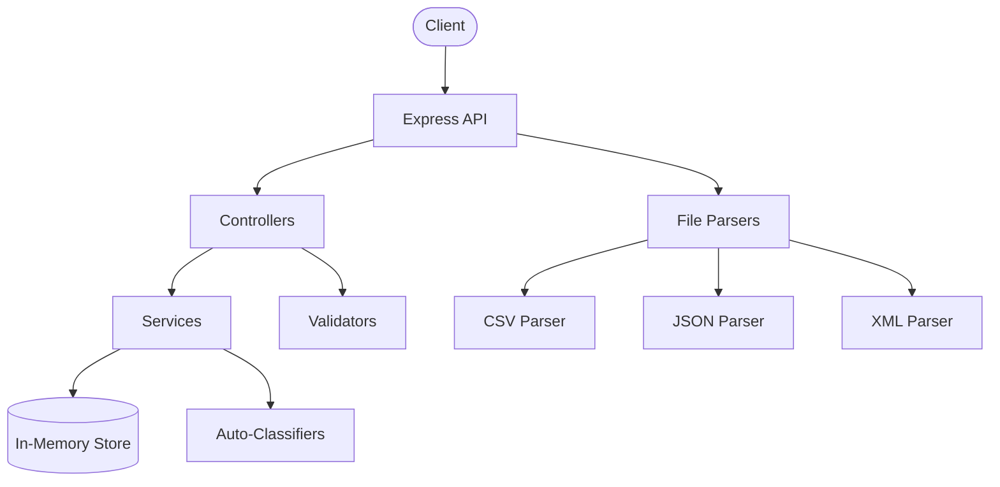

# Customer Support Ticket Management System


A REST API for managing customer support tickets with multi-format import (CSV, JSON, XML) and automatic categorization/priority assignment based on keyword analysis.

## Features

- CRUD operations for support tickets
- Bulk import from CSV, JSON, and XML files
- Automatic ticket classification (category & priority)
- Confidence scoring with decision logging
- Input validation with detailed error messages
- Filtering by category, priority, status, and more

## Architecture



## Quick Start

### Prerequisites

- Node.js 18+
- npm 9+

### Installation

```bash
cd homework-2
npm install
```

### Run Development Server

```bash
npm run dev
```

Server starts at `http://localhost:3000`

### Run Tests

```bash
npm test                 # Run all tests
npm run test:coverage    # With coverage report
```

## Project Structure

```
homework-2/
├── src/
│   ├── controllers/     # HTTP request handlers
│   ├── services/        # Business logic
│   ├── classifiers/     # Auto-classification logic
│   ├── parsers/         # CSV, JSON, XML parsers
│   ├── validators/      # Joi validation schemas
│   ├── models/          # Data models
│   ├── store/           # In-memory data store
│   ├── middleware/      # Error handling
│   ├── routes/          # Express routes
│   ├── types/           # TypeScript interfaces
│   └── utils/           # Constants, logger
├── tests/
│   ├── fixtures/        # Sample test data
│   └── *.test.ts        # Test files
├── docs/                # Documentation
└── logs/                # Classification logs
```

## Available Scripts

| Command | Description |
|---------|-------------|
| `npm run dev` | Start development server with ts-node |
| `npm run build` | Compile TypeScript to dist/ |
| `npm start` | Run compiled JavaScript |
| `npm test` | Run Jest tests |
| `npm run test:coverage` | Run tests with coverage report |
| `npm run test:watch` | Run tests in watch mode |

## API Endpoints

| Method | Endpoint | Description |
|--------|----------|-------------|
| POST | /tickets | Create ticket |
| POST | /tickets/import | Bulk import |
| GET | /tickets | List tickets |
| GET | /tickets/:id | Get ticket |
| PUT | /tickets/:id | Update ticket |
| DELETE | /tickets/:id | Delete ticket |
| POST | /tickets/:id/auto-classify | Auto-classify |

See [API Reference](docs/API_REFERENCE.md) for full documentation.

## Documentation

- [API Reference](docs/API_REFERENCE.md) - Endpoint documentation with examples
- [Architecture](docs/ARCHITECTURE.md) - System design and data flows
- [Testing Guide](docs/TESTING_GUIDE.md) - How to run and write tests
