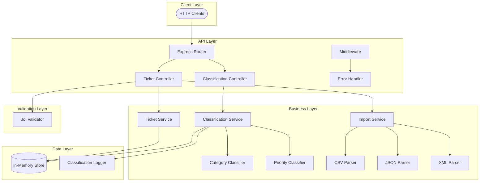
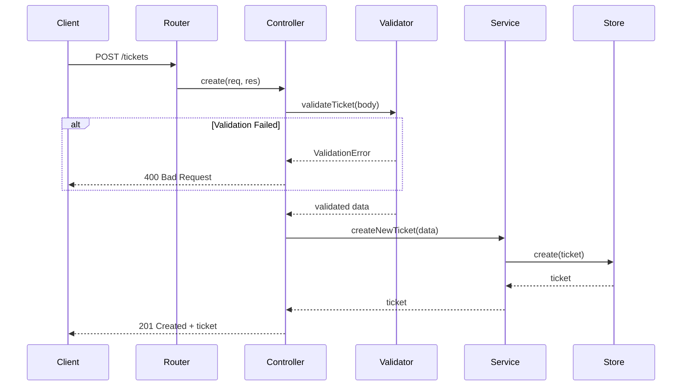
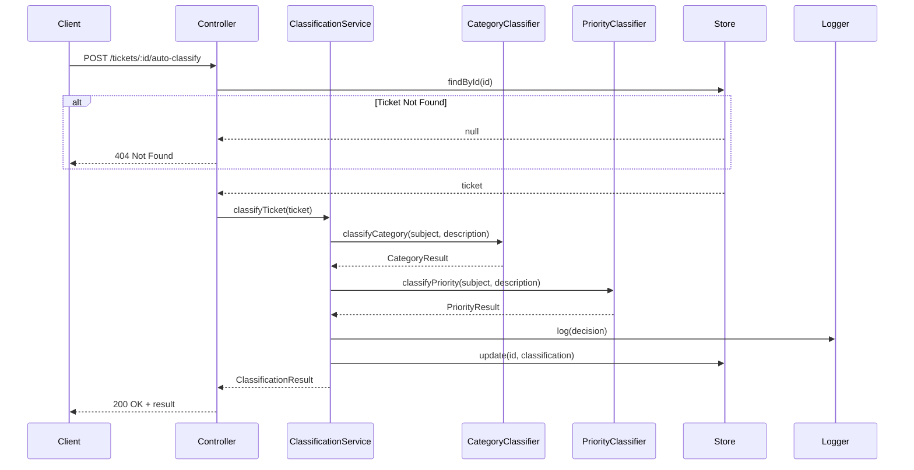
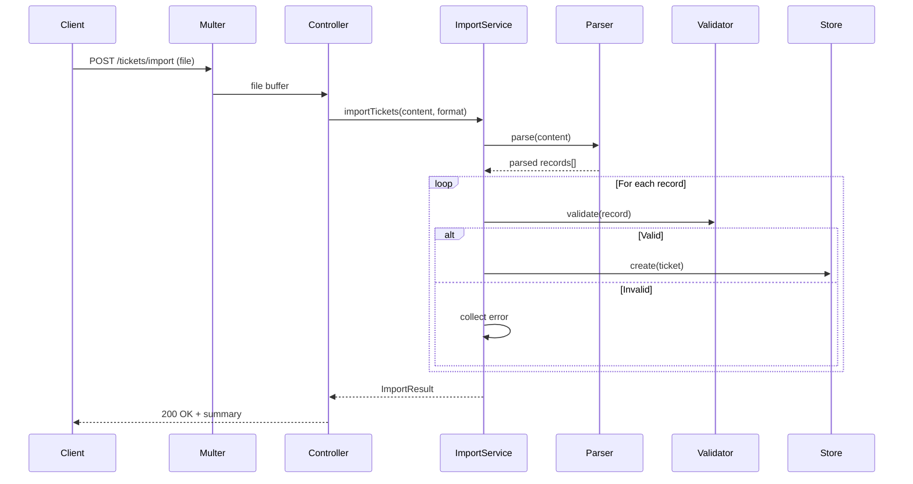

# Architecture

## System Overview

The Customer Support Ticket Management System is a RESTful API built with Node.js, Express, and TypeScript. It follows a layered architecture pattern with clear separation between API handling, business logic, and data storage. The system supports multi-format file imports and provides automatic ticket classification using keyword-based analysis.

## High-Level Architecture

## Component Descriptions

| Component | Responsibility | Key Files |
|-----------|---------------|-----------|
| **Router** | Route HTTP requests to controllers | `src/routes/tickets.ts` |
| **Controllers** | Handle HTTP requests/responses | `src/controllers/*.ts` |
| **Services** | Business logic and orchestration | `src/services/*.ts` |
| **Classifiers** | Keyword matching and classification | `src/classifiers/*.ts` |
| **Parsers** | Parse CSV, JSON, XML files | `src/parsers/*.ts` |
| **Validators** | Input validation with Joi | `src/validators/ticketValidator.ts` |
| **Store** | In-memory ticket storage | `src/store/inMemoryStore.ts` |
| **Middleware** | Error handling | `src/middleware/errorHandler.ts` |

## Data Flow - Ticket Creation

## Data Flow - Auto-Classification

## Data Flow - File Import

## Design Decisions

### In-Memory Store

**Decision:** Use an in-memory Map for ticket storage instead of a database.

**Rationale:**
- Simplifies development and testing
- No external dependencies required
- Fast read/write operations
- Suitable for demonstration purposes

**Trade-offs:**
- Data is lost on server restart
- Not suitable for production with high availability requirements
- Limited to single-server deployment

**Future Migration:** The store follows a repository pattern, making it easy to swap for a database implementation (MongoDB, PostgreSQL) by implementing the same interface.

### Keyword-Based Classification

**Decision:** Use keyword matching for automatic classification instead of ML models.

**Rationale:**
- Deterministic and explainable results
- No training data required
- Fast execution with no external API calls
- Easy to update keyword lists

**Trade-offs:**
- Less accurate than ML-based solutions
- Requires manual keyword curation
- Cannot learn from user corrections

**Confidence Scoring:**
- 3+ keyword matches: 0.9-1.0 confidence
- 2 matches: 0.75 confidence
- 1 match: 0.6 confidence
- No matches: 0.3 confidence (fallback)

### File Import Strategy

**Decision:** Parse entire file into memory, then process records sequentially.

**Rationale:**
- Simpler implementation
- Allows accurate row-level error reporting
- Suitable for files up to 10MB

**Trade-offs:**
- Memory usage scales with file size
- Not suitable for very large files (100MB+)

## Security Considerations

| Concern | Mitigation |
|---------|------------|
| Input Validation | Joi schema validation on all inputs |
| File Upload | File type and size restrictions (10MB max) |
| Error Messages | Sanitized errors without stack traces |
| Injection | No SQL (in-memory store), XML parser with safe defaults |

## Performance Considerations

| Operation | Performance Characteristic |
|-----------|---------------------------|
| Ticket CRUD | O(1) with Map-based storage |
| List with Filters | O(n) scan of all tickets |
| File Import | O(n) where n = number of records |
| Classification | O(k) where k = total keywords |

### Optimization Opportunities

1. Add indexing for common filter combinations
2. Implement pagination for large ticket lists
3. Use streaming parsers for large file imports
4. Cache classification results
