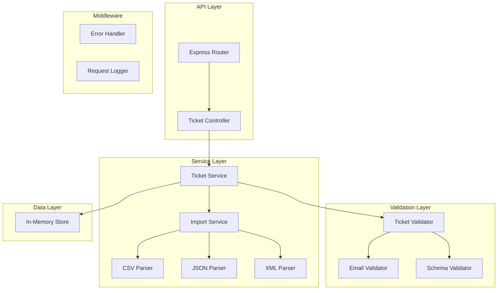

# Task 1: Multi-Format Ticket Import API - Implementation Plan

## 📋 Prompt for Implementation

You are an expert backend developer. Implement a REST API for a customer support ticket management system using **Node.js with Express and TypeScript**. Follow this implementation plan step by step.

---

## 🏗️ Architecture Overview



### Project Structure

```
homework-2/
├── src/
│   ├── app.ts                    # Express app configuration
│   ├── index.ts                  # Server entry point
│   ├── controllers/
│   │   └── ticketController.ts   # Request handlers
│   ├── services/
│   │   ├── ticketService.ts      # Business logic
│   │   └── importService.ts      # File parsing logic
│   ├── parsers/
│   │   ├── csvParser.ts          # CSV file parser
│   │   ├── jsonParser.ts         # JSON file parser
│   │   └── xmlParser.ts          # XML file parser
│   ├── validators/
│   │   └── ticketValidator.ts    # Input validation
│   ├── models/
│   │   └── ticket.ts             # Ticket model definition
│   ├── store/
│   │   └── inMemoryStore.ts      # In-memory data store
│   ├── middleware/
│   │   └── errorHandler.ts       # Global error handling
│   ├── routes/
│   │   ├── index.ts              # Route aggregator
│   │   └── tickets.ts            # Ticket routes
│   ├── types/
│   │   └── index.ts              # TypeScript interfaces and types
│   └── utils/
│       └── constants.ts          # Enums and constants
├── tests/
│   └── fixtures/                 # Sample test data files
├── package.json
├── tsconfig.json                 # TypeScript configuration
└── README.md
```

---

## 📝 Implementation Plan (Split by Tasks)

### Phase 1: Project Setup

**Step 1.1: Initialize Node.js Project with TypeScript**
- Create `package.json` with dependencies:
  - `express` - web framework
  - `uuid` - unique ID generation
  - `csv-parse` - CSV parsing
  - `xml2js` - XML parsing
  - `joi` - schema validation
  - `multer` - file upload handling
- Add TypeScript dev dependencies:
  - `typescript` - TypeScript compiler
  - `ts-node` - TypeScript execution
  - `@types/express` - Express type definitions
  - `@types/uuid` - UUID type definitions
  - `@types/multer` - Multer type definitions
  - `@types/xml2js` - XML2JS type definitions
- Create `package-lock.json`

**Step 1.2: Configure TypeScript**
Create `tsconfig.json`:
```json
{
  "compilerOptions": {
    "target": "ES2020",
    "module": "commonjs",
    "lib": ["ES2020"],
    "outDir": "./dist",
    "rootDir": "./src",
    "strict": true,
    "esModuleInterop": true,
    "skipLibCheck": true,
    "forceConsistentCasingInFileNames": true,
    "resolveJsonModule": true,
    "declaration": true,
    "declarationMap": true,
    "sourceMap": true
  },
  "include": ["src/**/*"],
  "exclude": ["node_modules", "dist", "tests"]
}
```

**Step 1.3: Create Project Structure**
- Create all directories as shown in the project structure
- Initialize empty files for all modules

**Step 1.4: Configure Express App**
- Setup Express application in `src/app.ts`
- Configure JSON body parser
- Configure file upload middleware (multer)
- Setup error handling middleware
- Create server entry point in `src/index.ts`

---

### Phase 2: Core Types, Models and Store

**Step 2.1: Define TypeScript Types and Interfaces**
Create `src/types/index.ts` with:
```typescript
// Category enum
export enum Category {
  ACCOUNT_ACCESS = 'account_access',
  TECHNICAL_ISSUE = 'technical_issue',
  BILLING_QUESTION = 'billing_question',
  FEATURE_REQUEST = 'feature_request',
  BUG_REPORT = 'bug_report',
  OTHER = 'other'
}

// Priority enum
export enum Priority {
  URGENT = 'urgent',
  HIGH = 'high',
  MEDIUM = 'medium',
  LOW = 'low'
}

// Status enum
export enum Status {
  NEW = 'new',
  IN_PROGRESS = 'in_progress',
  WAITING_CUSTOMER = 'waiting_customer',
  RESOLVED = 'resolved',
  CLOSED = 'closed'
}

// Source enum
export enum Source {
  WEB_FORM = 'web_form',
  EMAIL = 'email',
  API = 'api',
  CHAT = 'chat',
  PHONE = 'phone'
}

// Device type enum
export enum DeviceType {
  DESKTOP = 'desktop',
  MOBILE = 'mobile',
  TABLET = 'tablet'
}

// Metadata interface
export interface TicketMetadata {
  source?: Source;
  browser?: string;
  device_type?: DeviceType;
}

// Ticket interface
export interface Ticket {
  id: string;
  customer_id: string;
  customer_email: string;
  customer_name: string;
  subject: string;
  description: string;
  category: Category;
  priority: Priority;
  status: Status;
  created_at: Date;
  updated_at: Date;
  resolved_at: Date | null;
  assigned_to: string | null;
  tags: string[];
  metadata: TicketMetadata;
}

// Create ticket DTO
export interface CreateTicketDTO {
  customer_id: string;
  customer_email: string;
  customer_name: string;
  subject: string;
  description: string;
  category: Category;
  priority: Priority;
  status?: Status;
  tags?: string[];
  metadata?: TicketMetadata;
}

// Update ticket DTO
export interface UpdateTicketDTO {
  subject?: string;
  description?: string;
  category?: Category;
  priority?: Priority;
  status?: Status;
  assigned_to?: string | null;
  tags?: string[];
  metadata?: TicketMetadata;
}

// Import result interface
export interface ImportResult {
  total: number;
  successful: number;
  failed: number;
  errors: Array<{ row: number; errors: string[] }>;
  created_ids: string[];
}

// Filter interface
export interface TicketFilters {
  category?: Category;
  priority?: Priority;
  status?: Status;
  customer_id?: string;
  assigned_to?: string;
}
```

**Step 2.2: Define Constants**
Create `src/utils/constants.ts` with:
```typescript
import { Category, Priority, Status, Source, DeviceType } from '../types';

export const CATEGORIES = Object.values(Category);
export const PRIORITIES = Object.values(Priority);
export const STATUSES = Object.values(Status);
export const SOURCES = Object.values(Source);
export const DEVICE_TYPES = Object.values(DeviceType);
```

**Step 2.3: Create Ticket Model**
Create `src/models/ticket.ts`:
- Define Ticket class implementing the Ticket interface
- Include `id` (UUID), `customer_id`, `customer_email`, `customer_name`, `subject`, `description`
- Include `category`, `priority`, `status`
- Include timestamps: `created_at`, `updated_at`, `resolved_at`
- Include `assigned_to`, `tags`, `metadata`
- Add factory method `createTicket(data: CreateTicketDTO): Ticket` that generates UUID and sets timestamps

**Step 2.4: Create In-Memory Store**
Create `src/store/inMemoryStore.ts`:
- Implement singleton pattern for the store with proper TypeScript typing
- Methods: `create(ticket: Ticket): Ticket`, `findAll(filters?: TicketFilters): Ticket[]`, `findById(id: string): Ticket | null`, `update(id: string, data: UpdateTicketDTO): Ticket | null`, `delete(id: string): boolean`
- Support filtering by: `category`, `priority`, `status`, `customer_id`, `assigned_to`

---

### Phase 3: Validation Layer

**Step 3.1: Implement Ticket Validator**
Create `src/validators/ticketValidator.ts` using Joi:
- Validate `customer_email` - valid email format
- Validate `subject` - string, 1-200 characters, required
- Validate `description` - string, 10-2000 characters, required
- Validate `category` - must be one of Category enum values
- Validate `priority` - must be one of Priority enum values
- Validate `status` - must be one of Status enum values
- Validate `customer_id` - string, required
- Validate `customer_name` - string, required
- Validate `metadata.source` - must be one of Source enum values
- Validate `metadata.device_type` - must be one of DeviceType enum values
- Export functions: 
  - `validateTicket(data: unknown): { error?: Joi.ValidationError; value: CreateTicketDTO }`
  - `validatePartialTicket(data: unknown): { error?: Joi.ValidationError; value: UpdateTicketDTO }`

---

### Phase 4: File Parsers

**Step 4.1: Implement CSV Parser**
Create `src/parsers/csvParser.ts`:
- Define interface `ParsedTicketData` for raw parsed data
- Parse CSV content using `csv-parse` library
- Map CSV columns to ticket model fields
- Handle quoted fields and special characters
- Return `Promise<ParsedTicketData[]>` of parsed ticket objects
- Throw meaningful errors for malformed CSV

**Step 4.2: Implement JSON Parser**
Create `src/parsers/jsonParser.ts`:
- Parse JSON content (single ticket or array of tickets)
- Validate JSON structure
- Return `ParsedTicketData[]` of parsed ticket objects
- Throw meaningful errors for invalid JSON

**Step 4.3: Implement XML Parser**
Create `src/parsers/xmlParser.ts`:
- Parse XML content using `xml2js` library
- Expected structure: `<tickets><ticket>...</ticket></tickets>`
- Map XML elements to ticket model fields
- Return `Promise<ParsedTicketData[]>` of parsed ticket objects
- Throw meaningful errors for malformed XML

---

### Phase 5: Service Layer

**Step 5.1: Implement Import Service**
Create `src/services/importService.ts`:
- Define `FileFormat` type: `'csv' | 'json' | 'xml'`
- Detect file format by content type or file extension
- Route to appropriate parser (CSV, JSON, XML)
- Validate each parsed ticket
- Return `Promise<ImportResult>`:
  ```typescript
  interface ImportResult {
    total: number;
    successful: number;
    failed: number;
    errors: Array<{ row: number; errors: string[] }>;
    created_ids: string[];
  }
  ```

**Step 5.2: Implement Ticket Service**
Create `src/services/ticketService.ts`:
- `createTicket(data: CreateTicketDTO): Ticket` - validate, create, and store ticket
- `importTickets(fileContent: string, format: FileFormat): Promise<ImportResult>` - bulk import using importService
- `getAllTickets(filters?: TicketFilters): Ticket[]` - retrieve tickets with optional filtering
- `getTicketById(id: string): Ticket | null` - retrieve single ticket
- `updateTicket(id: string, data: UpdateTicketDTO): Ticket | null` - partial update ticket
- `deleteTicket(id: string): boolean` - remove ticket from store
- Handle business logic and error cases

---

### Phase 6: Controller and Routes

**Step 6.1: Implement Ticket Controller**
Create `src/controllers/ticketController.ts`:
- Import `Request`, `Response`, `NextFunction` from express
- `create(req: Request, res: Response, next: NextFunction): Promise<void>` - POST /tickets
- `importTickets(req: Request, res: Response, next: NextFunction): Promise<void>` - POST /tickets/import
- `getAll(req: Request, res: Response): void` - GET /tickets
- `getById(req: Request, res: Response): void` - GET /tickets/:id
- `update(req: Request, res: Response, next: NextFunction): Promise<void>` - PUT /tickets/:id
- `remove(req: Request, res: Response): void` - DELETE /tickets/:id

HTTP Status Codes:
- 201 Created - successful creation
- 200 OK - successful retrieval/update/delete
- 400 Bad Request - validation errors
- 404 Not Found - ticket not found
- 500 Internal Server Error - unexpected errors

**Step 6.2: Setup Routes**
Create `src/routes/tickets.ts`:
- Configure multer for file uploads with proper TypeScript typing
- Map routes to controller methods
- Setup query parameter parsing for filters

Create `src/routes/index.ts`:
- Aggregate all routes
- Mount ticket routes at `/tickets`

---

### Phase 7: Error Handling

**Step 7.1: Implement Error Handler Middleware**
Create `src/middleware/errorHandler.ts`:
- Custom error classes extending Error: 
  ```typescript
  export class ValidationError extends Error {
    statusCode = 400;
    code = 'VALIDATION_ERROR';
  }
  
  export class NotFoundError extends Error {
    statusCode = 404;
    code = 'NOT_FOUND';
  }
  ```
- Global error handler middleware with proper Express typing
- Format error responses consistently:
  ```typescript
  interface ErrorResponse {
    error: {
      code: string;
      message: string;
      details?: Record<string, unknown>;
    }
  }
  ```

---

## 🔌 API Endpoints Specification

### POST /tickets
Create a new support ticket.

**Request Body:**
```json
{
  "customer_id": "CUST001",
  "customer_email": "john@example.com",
  "customer_name": "John Doe",
  "subject": "Cannot login to my account",
  "description": "I've been trying to login but keep getting an error message...",
  "category": "account_access",
  "priority": "high",
  "tags": ["login", "urgent"],
  "metadata": {
    "source": "web_form",
    "browser": "Chrome 120",
    "device_type": "desktop"
  }
}
```

**Response (201 Created):**
```json
{
  "id": "550e8400-e29b-41d4-a716-446655440000",
  "customer_id": "CUST001",
  "customer_email": "john@example.com",
  "customer_name": "John Doe",
  "subject": "Cannot login to my account",
  "description": "I've been trying to login but keep getting an error message...",
  "category": "account_access",
  "priority": "high",
  "status": "new",
  "created_at": "2026-02-01T10:00:00.000Z",
  "updated_at": "2026-02-01T10:00:00.000Z",
  "resolved_at": null,
  "assigned_to": null,
  "tags": ["login", "urgent"],
  "metadata": {
    "source": "web_form",
    "browser": "Chrome 120",
    "device_type": "desktop"
  }
}
```

### POST /tickets/import
Bulk import tickets from CSV/JSON/XML file.

**Request:** multipart/form-data with file field named "file"

**Response (200 OK):**
```json
{
  "summary": {
    "total": 50,
    "successful": 48,
    "failed": 2
  },
  "errors": [
    {
      "row": 12,
      "errors": ["Invalid email format", "Subject is required"]
    },
    {
      "row": 35,
      "errors": ["Description must be at least 10 characters"]
    }
  ],
  "created_ids": ["uuid1", "uuid2", "..."]
}
```

### GET /tickets
List all tickets with optional filtering.

**Query Parameters:**
- `category` - filter by category
- `priority` - filter by priority
- `status` - filter by status
- `customer_id` - filter by customer
- `assigned_to` - filter by assignee

**Response (200 OK):**
```json
{
  "tickets": [...],
  "count": 25
}
```

### GET /tickets/:id
Get specific ticket by ID.

**Response (200 OK):** Single ticket object

**Response (404 Not Found):**
```json
{
  "error": {
    "code": "NOT_FOUND",
    "message": "Ticket with id 'xxx' not found"
  }
}
```

### PUT /tickets/:id
Update ticket (partial update supported).

**Request Body:** Any ticket fields to update

**Response (200 OK):** Updated ticket object

### DELETE /tickets/:id
Delete ticket.

**Response (200 OK):**
```json
{
  "message": "Ticket deleted successfully",
  "id": "550e8400-e29b-41d4-a716-446655440000"
}
```

---

## ✅ Validation Rules Summary

| Field | Rules |
|-------|-------|
| `customer_id` | Required, non-empty string |
| `customer_email` | Required, valid email format |
| `customer_name` | Required, non-empty string |
| `subject` | Required, 1-200 characters |
| `description` | Required, 10-2000 characters |
| `category` | Required, one of: account_access, technical_issue, billing_question, feature_request, bug_report, other |
| `priority` | Required, one of: urgent, high, medium, low |
| `status` | Optional (defaults to "new"), one of: new, in_progress, waiting_customer, resolved, closed |
| `tags` | Optional, array of strings |
| `metadata.source` | Optional, one of: web_form, email, api, chat, phone |
| `metadata.device_type` | Optional, one of: desktop, mobile, tablet |

---

## 🚀 Implementation Order

1. **Setup** - Initialize project, install dependencies, create structure
2. **Constants & Models** - Define enums and ticket model
3. **Store** - Implement in-memory storage
4. **Validators** - Implement Joi validation schemas
5. **Parsers** - Implement CSV, JSON, XML parsers
6. **Services** - Implement ticket and import services
7. **Controllers** - Implement request handlers
8. **Routes** - Setup Express routes
9. **Error Handling** - Implement global error handling
10. **Testing** - Test all endpoints manually

---

## 📦 Dependencies

```json
{
  "dependencies": {
    "express": "^4.18.2",
    "uuid": "^9.0.0",
    "csv-parse": "^5.5.0",
    "xml2js": "^0.6.2",
    "joi": "^17.11.0",
    "multer": "^1.4.5-lts.1"
  },
  "devDependencies": {
    "typescript": "^5.3.0",
    "ts-node": "^10.9.2",
    "ts-jest": "^29.1.1",
    "@types/express": "^4.17.21",
    "@types/uuid": "^9.0.7",
    "@types/multer": "^1.4.11",
    "@types/xml2js": "^0.4.14",
    "@types/node": "^20.10.0",
    "jest": "^29.7.0",
    "supertest": "^6.3.3",
    "@types/supertest": "^2.0.16"
  }
}
```

---

## 📝 Notes for Implementation

1. **Use async/await** consistently for all asynchronous operations
2. **Validate input early** - return 400 errors before processing
3. **Log errors** appropriately for debugging
4. **Keep controllers thin** - move business logic to services
5. **Handle edge cases** - empty files, wrong formats, missing fields
6. **Return consistent error format** across all endpoints
7. **Use strict TypeScript** - enable `strict: true` in tsconfig.json
8. **Type all function parameters and return values** explicitly
9. **Avoid `any` type** - use `unknown` with type guards when type is uncertain
10. **Use interfaces for DTOs** and type aliases for union types
