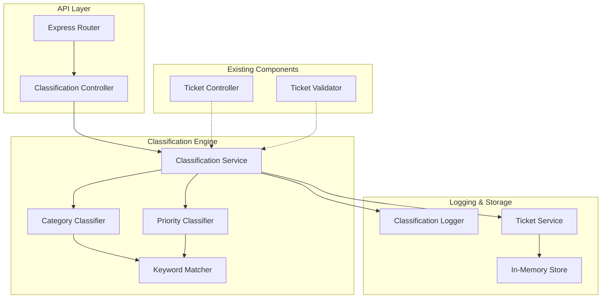
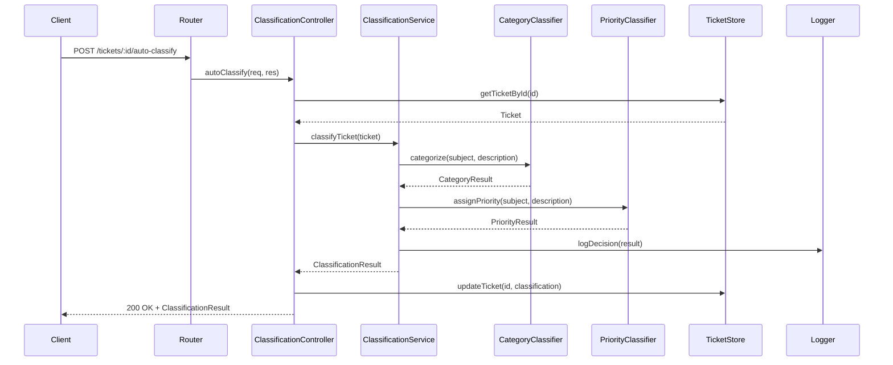

# Task 2: Auto-Classification - Implementation Plan

## 📋 Prompt for Implementation

You are an expert backend developer. Implement an automatic ticket categorization and priority assignment system for the existing customer support ticket management API using **Node.js with Express and TypeScript**. The system should analyze ticket content and automatically assign categories and priorities based on keyword matching. Follow this implementation plan step by step.

---

## 🏗️ Architecture Overview



### Data Flow - Auto-Classification



### Project Structure (New Files)

```
homework-2/
├── src/
│   ├── controllers/
│   │   └── classificationController.ts   # NEW: Classification request handlers
│   ├── services/
│   │   └── classificationService.ts      # NEW: Classification business logic
│   ├── classifiers/
│   │   ├── index.ts                      # NEW: Classifier exports
│   │   ├── categoryClassifier.ts         # NEW: Category classification logic
│   │   ├── priorityClassifier.ts         # NEW: Priority classification logic
│   │   └── keywordMatcher.ts             # NEW: Keyword matching utilities
│   ├── types/
│   │   └── index.ts                      # MODIFY: Add classification types
│   ├── utils/
│   │   ├── constants.ts                  # MODIFY: Add classification keywords
│   │   └── logger.ts                     # NEW: Classification decision logger
│   └── routes/
│       └── tickets.ts                    # MODIFY: Add classification route
└── logs/
    └── classification.log                # Classification decision logs
```

---

## 📝 Implementation Plan (Split by Tasks)

### Phase 1: Define Classification Types

**Step 1.1: Add Classification Types**
Modify `src/types/index.ts` to add:
```typescript
// Classification result for a category
export interface CategoryClassificationResult {
  category: Category;
  confidence: number;       // 0-1 score
  keywords_found: string[];
  reasoning: string;
}

// Classification result for priority
export interface PriorityClassificationResult {
  priority: Priority;
  confidence: number;       // 0-1 score
  keywords_found: string[];
  reasoning: string;
}

// Combined classification result
export interface ClassificationResult {
  ticket_id: string;
  category: CategoryClassificationResult;
  priority: PriorityClassificationResult;
  overall_confidence: number;
  classified_at: Date;
  auto_applied: boolean;
}

// Classification decision log entry
export interface ClassificationLogEntry {
  timestamp: Date;
  ticket_id: string;
  original_category: Category | null;
  original_priority: Priority | null;
  new_category: Category;
  new_priority: Priority;
  category_confidence: number;
  priority_confidence: number;
  keywords_found: string[];
  reasoning: string;
  was_override: boolean;
}

// Options for ticket creation with auto-classification
export interface CreateTicketOptions {
  auto_classify?: boolean;
}
```

---

### Phase 2: Define Classification Keywords

**Step 2.1: Add Keyword Constants**
Modify `src/utils/constants.ts` to add classification keyword mappings:
```typescript
// Category keywords mapping
export const CATEGORY_KEYWORDS: Record<Category, string[]> = {
  [Category.ACCOUNT_ACCESS]: [
    'login', 'password', 'reset password', 'forgot password', 'can\'t login',
    'cannot login', 'locked out', 'account locked', '2fa', 'two-factor',
    'authentication', 'sign in', 'signin', 'log in', 'access denied',
    'unauthorized', 'permission denied', 'credentials', 'username'
  ],
  [Category.TECHNICAL_ISSUE]: [
    'bug', 'error', 'crash', 'not working', 'broken', 'issue', 'problem',
    'fail', 'failed', 'failure', 'exception', 'glitch', 'malfunction',
    'slow', 'timeout', 'unresponsive', 'freeze', 'hang', '500 error',
    '404 error', 'server error', 'loading'
  ],
  [Category.BILLING_QUESTION]: [
    'payment', 'invoice', 'refund', 'charge', 'billing', 'subscription',
    'cancel subscription', 'upgrade', 'downgrade', 'plan', 'pricing',
    'receipt', 'transaction', 'credit card', 'bank', 'money', 'cost',
    'fee', 'discount', 'coupon', 'promo'
  ],
  [Category.FEATURE_REQUEST]: [
    'feature', 'request', 'suggestion', 'enhancement', 'improve',
    'would be nice', 'would like', 'wish', 'idea', 'propose', 'add',
    'new feature', 'capability', 'functionality', 'could you add'
  ],
  [Category.BUG_REPORT]: [
    'bug', 'defect', 'reproduce', 'steps to reproduce', 'regression',
    'unexpected behavior', 'expected', 'actual', 'should', 'instead',
    'broken feature', 'not as expected', 'wrong behavior'
  ],
  [Category.OTHER]: []  // Fallback category
};

// Priority keywords mapping
export const PRIORITY_KEYWORDS: Record<Priority, string[]> = {
  [Priority.URGENT]: [
    'urgent', 'critical', 'emergency', 'asap', 'immediately', 'production down',
    'security', 'security breach', 'data loss', 'can\'t access', 'cannot access',
    'completely broken', 'site down', 'service down', 'outage', 'blocked completely'
  ],
  [Priority.HIGH]: [
    'important', 'high priority', 'blocking', 'blocker', 'severe',
    'major', 'significant', 'need help now', 'affecting multiple',
    'business critical', 'deadline', 'time sensitive'
  ],
  [Priority.MEDIUM]: [],  // Default priority
  [Priority.LOW]: [
    'minor', 'cosmetic', 'low priority', 'when you have time', 'not urgent',
    'nice to have', 'suggestion', 'small issue', 'trivial', 'enhancement',
    'future', 'eventually', 'no rush'
  ]
};
```

---

### Phase 3: Implement Keyword Matcher

**Step 3.1: Create Keyword Matcher Utility**
Create `src/classifiers/keywordMatcher.ts`:
```typescript
export interface KeywordMatchResult {
  matched_keywords: string[];
  match_count: number;
  text_length: number;
  match_density: number;  // match_count / text_length ratio
}

export function matchKeywords(
  text: string, 
  keywords: string[]
): KeywordMatchResult;

export function normalizeText(text: string): string;

export function calculateConfidence(
  matchResult: KeywordMatchResult,
  maxExpectedMatches: number
): number;
```

Implementation details:
- `normalizeText()`: Convert to lowercase, remove special characters, normalize whitespace
- `matchKeywords()`: Search for each keyword in normalized text, return all matches
- `calculateConfidence()`: Calculate 0-1 confidence score based on match count and density
- Use word boundary matching to avoid partial matches (e.g., "log" in "catalog")

---

### Phase 4: Implement Category Classifier

**Step 4.1: Create Category Classifier**
Create `src/classifiers/categoryClassifier.ts`:
```typescript
import { Category } from '../types';
import { CategoryClassificationResult } from '../types';

export interface CategoryClassifierInput {
  subject: string;
  description: string;
}

export function classifyCategory(
  input: CategoryClassifierInput
): CategoryClassificationResult;

export function generateCategoryReasoning(
  category: Category,
  keywords: string[],
  confidence: number
): string;
```

Implementation details:
- Combine subject and description for analysis (subject weighted 2x)
- Match against all category keyword lists
- Select category with highest match score
- If no matches found, default to `Category.OTHER`
- Generate human-readable reasoning string
- Confidence calculation:
  - 0.9-1.0: Multiple strong keyword matches
  - 0.7-0.89: Single strong match or multiple weak matches
  - 0.5-0.69: Weak matches only
  - 0.3-0.49: Very few matches (defaulting to OTHER)

---

### Phase 5: Implement Priority Classifier

**Step 5.1: Create Priority Classifier**
Create `src/classifiers/priorityClassifier.ts`:
```typescript
import { Priority } from '../types';
import { PriorityClassificationResult } from '../types';

export interface PriorityClassifierInput {
  subject: string;
  description: string;
}

export function classifyPriority(
  input: PriorityClassifierInput
): PriorityClassificationResult;

export function generatePriorityReasoning(
  priority: Priority,
  keywords: string[],
  confidence: number
): string;
```

Implementation details:
- Check keywords in order: URGENT → HIGH → LOW → MEDIUM (default)
- Priority is determined by first match (urgency takes precedence)
- If no priority keywords found, default to `Priority.MEDIUM`
- Confidence is higher for explicit keyword matches, lower for defaults
- Generate reasoning explaining why this priority was assigned

---

### Phase 6: Implement Classification Logger

**Step 6.1: Create Classification Logger**
Create `src/utils/logger.ts`:
```typescript
import { ClassificationLogEntry } from '../types';

export class ClassificationLogger {
  private logFile: string;
  
  constructor(logFile?: string);
  
  log(entry: ClassificationLogEntry): void;
  
  getRecentLogs(count: number): ClassificationLogEntry[];
  
  getLogsByTicketId(ticketId: string): ClassificationLogEntry[];
}

export const classificationLogger: ClassificationLogger;
```

Implementation details:
- Log to both console and file (logs/classification.log)
- Each log entry includes timestamp, ticket_id, all classification details
- Log format: JSON lines for easy parsing
- Include method to query recent decisions for debugging

---

### Phase 7: Implement Classification Service

**Step 7.1: Create Classification Service**
Create `src/services/classificationService.ts`:
```typescript
import { Ticket, ClassificationResult, ClassificationLogEntry } from '../types';
import { classifyCategory } from '../classifiers/categoryClassifier';
import { classifyPriority } from '../classifiers/priorityClassifier';
import { classificationLogger } from '../utils/logger';
import { ticketStore } from '../store/inMemoryStore';

export class ClassificationService {
  /**
   * Classify a ticket and optionally apply the results
   */
  classifyTicket(
    ticket: Ticket, 
    applyResults: boolean = true
  ): ClassificationResult;
  
  /**
   * Re-classify a ticket (manual override)
   */
  reclassifyTicket(
    ticketId: string,
    applyResults: boolean = true
  ): ClassificationResult;
  
  /**
   * Get classification history for a ticket
   */
  getClassificationHistory(ticketId: string): ClassificationLogEntry[];
  
  /**
   * Calculate overall confidence from category and priority confidence
   */
  private calculateOverallConfidence(
    categoryConfidence: number,
    priorityConfidence: number
  ): number;
}

export const classificationService: ClassificationService;
```

Implementation details:
- `classifyTicket()`: Run both classifiers, combine results, log decision
- If `applyResults=true`, update the ticket in store with new category/priority
- `reclassifyTicket()`: Fetch ticket by ID, run classification, mark as override
- Overall confidence = weighted average (category: 60%, priority: 40%)
- Always log decisions for audit trail

---

### Phase 8: Implement Classification Controller

**Step 8.1: Create Classification Controller**
Create `src/controllers/classificationController.ts`:
```typescript
import { Request, Response, NextFunction } from 'express';
import { classificationService } from '../services/classificationService';
import { ticketService } from '../services/ticketService';
import { NotFoundError } from '../middleware/errorHandler';

export class ClassificationController {
  /**
   * POST /tickets/:id/auto-classify
   * Automatically classify a ticket
   */
  autoClassify = async (
    req: Request, 
    res: Response, 
    next: NextFunction
  ): Promise<void>;
  
  /**
   * GET /tickets/:id/classification-history
   * Get classification history for a ticket
   */
  getHistory = async (
    req: Request, 
    res: Response, 
    next: NextFunction
  ): Promise<void>;
}

export const classificationController: ClassificationController;
```

Implementation details:
- `autoClassify`: 
  - Validate ticket exists (404 if not)
  - Call classificationService.classifyTicket()
  - Return classification result with 200 OK
- `getHistory`:
  - Validate ticket exists (404 if not)
  - Return array of classification log entries

---

### Phase 9: Update Routes

**Step 9.1: Add Classification Routes**
Modify `src/routes/tickets.ts` to add:
```typescript
// Auto-classify a ticket
router.post('/:id/auto-classify', classificationController.autoClassify);

// Get classification history
router.get('/:id/classification-history', classificationController.getHistory);
```

---

### Phase 10: Integrate with Ticket Creation

**Step 10.1: Modify Ticket Controller**
Update `src/controllers/ticketController.ts`:
- Add optional query parameter `auto_classify=true` to POST /tickets
- If flag is set, run auto-classification after creating ticket
- Return both ticket and classification result in response

**Step 10.2: Modify Ticket Service**
Update `src/services/ticketService.ts`:
- Add method `createTicketWithClassification(data, autoClassify)`
- If autoClassify is true, run classification after creation
- Return combined result

---

## 🔌 API Endpoints Specification

### POST /tickets/:id/auto-classify
Automatically classify a ticket's category and priority.

**Request:**
```
POST /tickets/550e8400-e29b-41d4-a716-446655440000/auto-classify
```

**Response (200 OK):**
```json
{
  "ticket_id": "550e8400-e29b-41d4-a716-446655440000",
  "category": {
    "category": "account_access",
    "confidence": 0.85,
    "keywords_found": ["login", "password", "can't access"],
    "reasoning": "High confidence match for account_access category based on keywords: login, password, can't access. The ticket describes login and password issues."
  },
  "priority": {
    "priority": "urgent",
    "confidence": 0.92,
    "keywords_found": ["can't access", "critical"],
    "reasoning": "Urgent priority assigned due to keywords: can't access, critical. Customer is blocked from accessing the system."
  },
  "overall_confidence": 0.88,
  "classified_at": "2026-02-01T10:00:00.000Z",
  "auto_applied": true
}
```

**Response (404 Not Found):**
```json
{
  "error": {
    "code": "NOT_FOUND",
    "message": "Ticket with id '550e8400-e29b-41d4-a716-446655440000' not found"
  }
}
```

### GET /tickets/:id/classification-history
Get the classification decision history for a ticket.

**Response (200 OK):**
```json
{
  "ticket_id": "550e8400-e29b-41d4-a716-446655440000",
  "history": [
    {
      "timestamp": "2026-02-01T10:00:00.000Z",
      "ticket_id": "550e8400-e29b-41d4-a716-446655440000",
      "original_category": null,
      "original_priority": null,
      "new_category": "account_access",
      "new_priority": "urgent",
      "category_confidence": 0.85,
      "priority_confidence": 0.92,
      "keywords_found": ["login", "password", "can't access", "critical"],
      "reasoning": "Auto-classified on ticket creation",
      "was_override": false
    }
  ]
}
```

### POST /tickets (with auto-classification)
Create a ticket with optional auto-classification.

**Request:**
```
POST /tickets?auto_classify=true
Content-Type: application/json

{
  "customer_id": "CUST001",
  "customer_email": "john@example.com",
  "customer_name": "John Doe",
  "subject": "Can't login to my account - critical issue",
  "description": "I've been trying to login but keep getting an error. My password reset isn't working either. This is critical for my business.",
  "category": "other",
  "priority": "medium"
}
```

**Response (201 Created):**
```json
{
  "ticket": {
    "id": "550e8400-e29b-41d4-a716-446655440000",
    "customer_id": "CUST001",
    "customer_email": "john@example.com",
    "customer_name": "John Doe",
    "subject": "Can't login to my account - critical issue",
    "description": "I've been trying to login but keep getting an error...",
    "category": "account_access",
    "priority": "urgent",
    "status": "new",
    "created_at": "2026-02-01T10:00:00.000Z",
    "updated_at": "2026-02-01T10:00:00.000Z",
    "resolved_at": null,
    "assigned_to": null,
    "tags": [],
    "metadata": {}
  },
  "classification": {
    "ticket_id": "550e8400-e29b-41d4-a716-446655440000",
    "category": {
      "category": "account_access",
      "confidence": 0.85,
      "keywords_found": ["login", "password"],
      "reasoning": "..."
    },
    "priority": {
      "priority": "urgent",
      "confidence": 0.92,
      "keywords_found": ["critical", "can't login"],
      "reasoning": "..."
    },
    "overall_confidence": 0.88,
    "classified_at": "2026-02-01T10:00:00.000Z",
    "auto_applied": true
  }
}
```

---

## 📊 Classification Rules Summary

### Category Classification

| Category | Keywords |
|----------|----------|
| `account_access` | login, password, reset password, forgot password, can't login, locked out, 2fa, two-factor, authentication, sign in, access denied |
| `technical_issue` | bug, error, crash, not working, broken, issue, problem, fail, exception, slow, timeout, freeze, server error |
| `billing_question` | payment, invoice, refund, charge, billing, subscription, pricing, receipt, transaction, credit card, money |
| `feature_request` | feature, request, suggestion, enhancement, improve, would be nice, idea, add, new feature |
| `bug_report` | bug, defect, reproduce, steps to reproduce, regression, unexpected behavior, expected vs actual |
| `other` | (fallback when no matches) |

### Priority Classification

| Priority | Keywords |
|----------|----------|
| `urgent` | urgent, critical, emergency, asap, production down, security, can't access, site down, outage |
| `high` | important, high priority, blocking, severe, major, business critical, deadline |
| `medium` | (default when no matches) |
| `low` | minor, cosmetic, low priority, not urgent, nice to have, suggestion, trivial, no rush |

### Confidence Score Calculation

```typescript
// Category confidence
if (matchCount >= 3) confidence = 0.9 + (matchCount - 3) * 0.02; // max 1.0
else if (matchCount === 2) confidence = 0.75;
else if (matchCount === 1) confidence = 0.6;
else confidence = 0.3; // fallback to OTHER

// Priority confidence
if (matchCount >= 2) confidence = 0.9 + (matchCount - 2) * 0.03; // max 1.0
else if (matchCount === 1) confidence = 0.8;
else confidence = 0.5; // default to MEDIUM

// Overall confidence (weighted average)
overallConfidence = categoryConfidence * 0.6 + priorityConfidence * 0.4;
```

---

## 🚀 Implementation Order

1. **Types** - Add classification interfaces to types/index.ts
2. **Constants** - Add keyword mappings to utils/constants.ts
3. **Keyword Matcher** - Create classifiers/keywordMatcher.ts
4. **Category Classifier** - Create classifiers/categoryClassifier.ts
5. **Priority Classifier** - Create classifiers/priorityClassifier.ts
6. **Logger** - Create utils/logger.ts
7. **Classification Service** - Create services/classificationService.ts
8. **Classification Controller** - Create controllers/classificationController.ts
9. **Routes** - Update routes/tickets.ts with new endpoints
10. **Integration** - Update ticket creation to support auto_classify flag
11. **Testing** - Test all classification scenarios

---

## 📦 No Additional Dependencies Required

This implementation uses only the existing project dependencies. The classification logic is based on keyword matching and does not require external NLP or ML libraries.

---

## 📝 Notes for Implementation

1. **Keyword matching should be case-insensitive** - normalize all text to lowercase
2. **Use word boundaries** - "log" should not match "catalog"
3. **Subject should be weighted higher** than description for classification
4. **Always log classification decisions** - this is required for audit trail
5. **Manual override should still be possible** - users can PUT /tickets/:id to change category/priority
6. **Confidence scores should be meaningful** - explain how they're calculated
7. **Handle edge cases** - empty subject, very long description, special characters
8. **Classification history should be immutable** - never delete log entries
