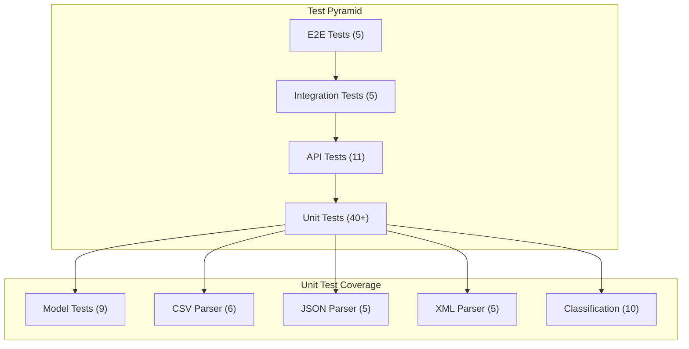

# Task 3: AI-Generated Test Suite - Implementation Plan

## 📋 Prompt for Implementation

You are an expert backend developer and test engineer. Implement a comprehensive test suite for the existing Customer Support Ticket Management System using **Jest with TypeScript**. The tests must achieve >85% code coverage. Follow this implementation plan step by step.

---

## 🏗️ Test Architecture Overview



### Test File Structure

```
tests/
├── helpers/
│   └── testUtils.ts              # Shared test utilities
├── fixtures/
│   ├── valid_tickets.csv         # Valid CSV data (50 records)
│   ├── valid_tickets.json        # Valid JSON data (20 records)
│   ├── valid_tickets.xml         # Valid XML data (30 records)
│   ├── invalid_tickets.csv       # Invalid CSV for negative tests
│   ├── invalid_tickets.json      # Invalid JSON for negative tests
│   └── invalid_tickets.xml       # Invalid XML for negative tests
├── test_ticket_api.test.ts       # API endpoint tests (11)
├── test_ticket_model.test.ts     # Model validation tests (9)
├── test_import_csv.test.ts       # CSV parser tests (6)
├── test_import_json.test.ts      # JSON parser tests (5)
├── test_import_xml.test.ts       # XML parser tests (5)
├── test_categorization.test.ts   # Classification tests (10)
├── test_integration.test.ts      # End-to-end workflows (5)
└── test_performance.test.ts      # Performance benchmarks (5)
```

---

## 📝 Implementation Plan

### Phase 1: Test Infrastructure Setup

**Step 1.1: Create Test Utilities Helper**

Create `tests/helpers/testUtils.ts`:

```typescript
import { CreateTicketDTO, Ticket, ParsedTicketData, Category, Priority, Status } from '../../src/types';
import { store } from '../../src/store/inMemoryStore';

// Factory for valid ticket data
export function createValidTicketData(overrides?: Partial<CreateTicketDTO>): CreateTicketDTO {
  return {
    customer_id: 'CUST001',
    customer_email: 'test@example.com',
    customer_name: 'Test User',
    subject: 'Test ticket subject',
    description: 'This is a test ticket description with enough characters',
    category: Category.TECHNICAL_ISSUE,
    priority: Priority.MEDIUM,
    ...overrides
  };
}

// Factory for invalid ticket data
export function createInvalidTicketData(invalidField: string): object {
  const base = createValidTicketData();
  switch (invalidField) {
    case 'email': return { ...base, customer_email: 'invalid-email' };
    case 'subject': return { ...base, subject: '' };
    case 'description': return { ...base, description: 'short' };
    case 'category': return { ...base, category: 'invalid' };
    default: return base;
  }
}

// Store management
export function clearStore(): void {
  store.clear();
}

export function seedStore(count: number): string[] {
  const ids: string[] = [];
  for (let i = 0; i < count; i++) {
    const ticket = createValidTicketData({ customer_id: `CUST${i}` });
    // Create via service to get ID
  }
  return ids;
}
```

**Step 1.2: Verify Jest Configuration**

Ensure `jest.config.js` has:
- Coverage threshold: 85% (branches, functions, lines, statements)
- Test environment: node
- TypeScript preset: ts-jest

---

### Phase 2: API Endpoint Tests (11 tests)

**File:** `tests/test_ticket_api.test.ts`

| # | Test Name | HTTP | Endpoint | Expected |
|---|-----------|------|----------|----------|
| 1 | Create ticket with valid data | POST | /tickets | 201, ticket with id |
| 2 | Create ticket with auto-classify | POST | /tickets?auto_classify=true | 201, ticket + classification |
| 3 | Return 400 for invalid email | POST | /tickets | 400, VALIDATION_ERROR |
| 4 | Return 400 for missing field | POST | /tickets | 400, errors array |
| 5 | Get existing ticket by ID | GET | /tickets/:id | 200, ticket object |
| 6 | Return 404 for non-existent | GET | /tickets/:id | 404, NOT_FOUND |
| 7 | List all tickets | GET | /tickets | 200, { tickets, count } |
| 8 | Filter tickets by category | GET | /tickets?category=X | 200, filtered results |
| 9 | Update ticket successfully | PUT | /tickets/:id | 200, updated ticket |
| 10 | Delete ticket successfully | DELETE | /tickets/:id | 200, success message |
| 11 | Return 404 deleting non-existent | DELETE | /tickets/:id | 404, NOT_FOUND |

**Template:**

```typescript
import request from 'supertest';
import app from '../src/app';
import { store } from '../src/store/inMemoryStore';
import { createValidTicketData } from './helpers/testUtils';

describe('Ticket API', () => {
  beforeEach(() => {
    store.clear();
  });

  describe('POST /tickets', () => {
    it('should create ticket with valid data', async () => {
      const response = await request(app)
        .post('/tickets')
        .send(createValidTicketData());

      expect(response.status).toBe(201);
      expect(response.body).toHaveProperty('id');
    });

    it('should return 400 for invalid email', async () => {
      const response = await request(app)
        .post('/tickets')
        .send({ ...createValidTicketData(), customer_email: 'invalid' });

      expect(response.status).toBe(400);
      expect(response.body.error.code).toBe('VALIDATION_ERROR');
    });
  });
});
```

---

### Phase 3: Model Validation Tests (9 tests)

**File:** `tests/test_ticket_model.test.ts`

| # | Test Name | Input | Expected |
|---|-----------|-------|----------|
| 1 | Valid ticket passes | Complete valid data | No errors |
| 2 | Reject invalid email | "invalid-email" | Invalid email format |
| 3 | Reject missing customer_id | Omit field | customer_id is required |
| 4 | Reject empty subject | subject: "" | Subject is required |
| 5 | Reject long subject | 201 chars | max 200 characters |
| 6 | Reject short description | "Short" | min 10 characters |
| 7 | Reject invalid category | "invalid" | must be one of |
| 8 | Reject invalid priority | "super" | must be one of |
| 9 | Accept optional fields | Minimal data | No errors |

**Template:**

```typescript
import { validateTicket } from '../src/validators/ticketValidator';
import { createValidTicketData, createInvalidTicketData } from './helpers/testUtils';

describe('Ticket Validation', () => {
  it('should pass validation with valid data', () => {
    const { error } = validateTicket(createValidTicketData());
    expect(error).toBeUndefined();
  });

  it('should reject invalid email format', () => {
    const { error } = validateTicket(createInvalidTicketData('email'));
    expect(error).toBeDefined();
    expect(error!.details[0].message).toContain('email');
  });
});
```

---

### Phase 4: CSV Parser Tests (6 tests)

**File:** `tests/test_import_csv.test.ts`

| # | Test Name | Input | Expected |
|---|-----------|-------|----------|
| 1 | Parse valid CSV | Standard CSV | Array of ParsedTicketData |
| 2 | Handle comma-separated tags | "tag1,tag2" | tags: ['tag1','tag2'] |
| 3 | Parse metadata columns | source,browser | Nested metadata |
| 4 | Throw for empty content | "" | CSV content is empty |
| 5 | Handle missing columns | No tags column | undefined tags |
| 6 | Skip empty lines | CSV with blanks | Only valid records |

**Template:**

```typescript
import { parseCSV } from '../src/parsers/csvParser';

describe('CSV Parser', () => {
  it('should parse valid CSV content', () => {
    const csv = `customer_id,customer_email,customer_name,subject,description,category,priority
CUST001,test@example.com,Test User,Test Subject,Test description here,technical_issue,medium`;

    const result = parseCSV(csv);
    expect(result).toHaveLength(1);
    expect(result[0].customer_id).toBe('CUST001');
  });

  it('should throw error for empty content', () => {
    expect(() => parseCSV('')).toThrow('CSV content is empty');
  });
});
```

---

### Phase 5: JSON Parser Tests (5 tests)

**File:** `tests/test_import_json.test.ts`

| # | Test Name | Input | Expected |
|---|-----------|-------|----------|
| 1 | Parse valid JSON array | Array | Array of ParsedTicketData |
| 2 | Parse single object | Object | Array with one item |
| 3 | Throw for empty content | "" | JSON content is empty |
| 4 | Throw for invalid syntax | "{ invalid" | Invalid JSON syntax |
| 5 | Handle nested metadata | With metadata | Mapped metadata |

---

### Phase 6: XML Parser Tests (5 tests)

**File:** `tests/test_import_xml.test.ts`

| # | Test Name | Input | Expected |
|---|-----------|-------|----------|
| 1 | Parse valid XML | `<tickets>...</tickets>` | Array of ParsedTicketData |
| 2 | Parse single ticket | `<ticket>...</ticket>` | Array with one item |
| 3 | Throw for empty content | "" | XML content is empty |
| 4 | Throw for malformed XML | Unclosed tags | Failed to parse XML |
| 5 | Handle nested metadata | With metadata child | Mapped metadata |

---

### Phase 7: Classification Tests (10 tests)

**File:** `tests/test_categorization.test.ts`

**Category Tests:**

| # | Input Keywords | Expected Category |
|---|----------------|-------------------|
| 1 | "can't login", "password" | account_access |
| 2 | "error", "crash" | technical_issue |
| 3 | "invoice", "refund" | billing_question |
| 4 | "would like", "suggestion" | feature_request |
| 5 | "bug", "reproduce" | bug_report |
| 6 | No keywords | other |

**Priority Tests:**

| # | Input Keywords | Expected Priority |
|---|----------------|-------------------|
| 7 | "critical", "production down" | urgent |
| 8 | "important", "blocking" | high |
| 9 | "minor", "when you have time" | low |
| 10 | No keywords | medium |

**Template:**

```typescript
import { classifyCategory } from '../src/classifiers/categoryClassifier';
import { classifyPriority } from '../src/classifiers/priorityClassifier';
import { Category, Priority } from '../src/types';

describe('Category Classifier', () => {
  it('should classify as account_access for login keywords', () => {
    const result = classifyCategory({
      subject: "Can't login to my account",
      description: 'Password reset not working'
    });

    expect(result.category).toBe(Category.ACCOUNT_ACCESS);
    expect(result.confidence).toBeGreaterThan(0.5);
    expect(result.keywords_found.length).toBeGreaterThan(0);
  });
});

describe('Priority Classifier', () => {
  it('should classify as urgent for critical keywords', () => {
    const result = classifyPriority({
      subject: 'CRITICAL: Production down',
      description: 'System is completely broken'
    });

    expect(result.priority).toBe(Priority.URGENT);
    expect(result.confidence).toBeGreaterThan(0.7);
  });
});
```

---

### Phase 8: Integration Tests (5 tests)

**File:** `tests/test_integration.test.ts`

| # | Test Name | Description |
|---|-----------|-------------|
| 1 | Complete lifecycle | Create → Update → Resolve → Delete |
| 2 | Bulk import + classify | Import CSV → Auto-classify all |
| 3 | Classification history | Classify → Reclassify → Check history |
| 4 | Multi-filter query | Filter by category + priority |
| 5 | Concurrent requests | 20 parallel POSTs |

**Template:**

```typescript
describe('Integration Tests', () => {
  it('should handle complete ticket lifecycle', async () => {
    // Create
    const createRes = await request(app).post('/tickets').send(validData);
    const id = createRes.body.id;

    // Update
    await request(app).put(`/tickets/${id}`).send({ status: 'in_progress' });

    // Resolve
    await request(app).put(`/tickets/${id}`).send({ status: 'resolved' });
    
    // Verify resolved_at
    const getRes = await request(app).get(`/tickets/${id}`);
    expect(getRes.body.resolved_at).not.toBeNull();

    // Delete
    await request(app).delete(`/tickets/${id}`);
  });

  it('should handle concurrent requests', async () => {
    const promises = Array(20).fill(null).map(() =>
      request(app).post('/tickets').send(createValidTicketData())
    );

    const results = await Promise.all(promises);
    results.forEach(res => expect(res.status).toBe(201));
  });
});
```

---

### Phase 9: Performance Tests (5 tests)

**File:** `tests/test_performance.test.ts`

| # | Operation | Target |
|---|-----------|--------|
| 1 | Create ticket | <50ms |
| 2 | Get ticket by ID | <10ms |
| 3 | List 100 tickets | <100ms |
| 4 | Import 50 via CSV | <500ms |
| 5 | Auto-classify | <20ms |

**Template:**

```typescript
describe('Performance Tests', () => {
  it('should create ticket within 50ms', async () => {
    const start = Date.now();
    await request(app).post('/tickets').send(createValidTicketData());
    expect(Date.now() - start).toBeLessThan(50);
  });
});
```

---

### Phase 10: Expand Test Fixtures

**valid_tickets.csv** — 50 records covering all categories/priorities  
**valid_tickets.json** — 20 records with varied metadata  
**valid_tickets.xml** — 30 records with nested elements  
**invalid_tickets.xml** — Create for negative tests

---

## ✅ Coverage Checklist

| Component | Target |
|-----------|--------|
| controllers/ | >85% |
| services/ | >85% |
| parsers/ | >85% |
| classifiers/ | >85% |
| validators/ | >85% |
| models/ | >85% |
| store/ | >85% |

---

## 🚀 Running Tests

```bash
npm test                    # Run all tests
npm run test:coverage       # With coverage report
npm test -- tests/test_ticket_api.test.ts  # Specific file
npm run test:watch          # Watch mode
```
