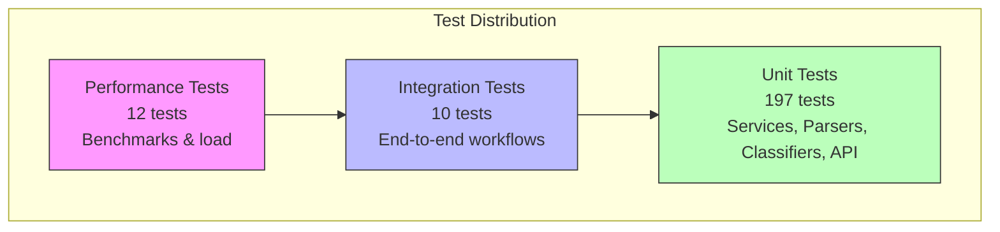

# Testing Guide

## Overview

| Metric | Target |
|--------|--------|
| Code Coverage | >85% (branches >84%) |
| Test Framework | Jest |
| Assertion Library | Jest built-in |
| HTTP Testing | Supertest |
| Total Tests | 219 |

## Test Pyramid



## Running Tests

### All Tests

```bash
npm test
```

### Unit Tests Only

```bash
npm run test:unit
```

### Integration Tests Only

```bash
npm run test:integration
```

### Performance Tests Only

```bash
npm run test:performance
```

### Unit Tests with Coverage Report

```bash
npm run test:unit:coverage
```

Coverage report is generated in `coverage/` directory. Open `coverage/lcov-report/index.html` in a browser for detailed view.

### Watch Mode

```bash
npm run test:watch
```

### Run Specific Test File

```bash
npm test -- tests/test_ticket_api.test.ts
```

### Run Tests Matching Pattern

```bash
npm test -- --testNamePattern="should create ticket"
```

## Test File Structure

```
tests/
├── fixtures/                         # Sample test data
│   ├── valid_tickets.csv
│   ├── valid_tickets.json
│   ├── valid_tickets.xml
│   ├── invalid_tickets.csv
│   ├── invalid_tickets.json
│   └── invalid_tickets.xml
├── helpers/
│   └── testUtils.ts                  # Shared test utilities
├── test_ticket_api.test.ts           # API endpoint tests
├── test_ticket_model.test.ts         # Model validation tests
├── test_import_csv.test.ts           # CSV parser tests
├── test_import_json.test.ts          # JSON parser tests
├── test_import_xml.test.ts           # XML parser tests
├── test_import_service.test.ts       # Import service tests
├── test_categorization.test.ts       # Classification tests
├── test_classification_service.test.ts # Classification service tests
├── test_logger.test.ts               # Logger tests
├── test_error_handling.test.ts       # Error handling tests
├── test_integration.test.ts          # End-to-end integration tests
└── test_performance.test.ts          # Performance benchmarks
```

## Test Categories

### Unit Tests (197 tests)

| Test File | What it Tests | Tests |
|-----------|--------------|-------|
| test_ticket_api | CRUD endpoints, status codes, error responses | 24 |
| test_ticket_model | Joi validation, field constraints | 25 |
| test_import_csv | CSV parsing, column mapping, error handling | 14 |
| test_import_json | JSON parsing, array/object handling | 11 |
| test_import_xml | XML parsing, nested elements | 14 |
| test_import_service | Import service, format detection | 32 |
| test_categorization | Keyword matching, confidence scores | 26 |
| test_classification_service | Classification service logic | 23 |
| test_logger | Classification logger | 10 |
| test_error_handling | Error middleware, custom errors | 18 |

### Integration Tests (10 tests)

| Test ID | What it Tests |
|---------|---------------|
| INT-01 | Complete ticket lifecycle (Create → Update → Resolve → Delete) |
| INT-02 | Bulk CSV import with auto-classification |
| INT-03 | Classification history tracking |
| INT-04 | Multi-filter query (category + priority + status) |
| INT-05 | Concurrent ticket creation (20+ simultaneous) |
| INT-06 | Multi-format import workflow (CSV, JSON, XML) |
| INT-07 | Error recovery with mixed valid/invalid records |
| INT-08 | Auto-classify on create flag |

### Performance Tests (12 tests)

| Test ID | What it Tests | Threshold |
|---------|---------------|-----------|
| PERF-01 | Single ticket creation | < 100ms |
| PERF-02 | Ticket retrieval by ID | < 50ms |
| PERF-03 | List 100 tickets | < 100ms |
| PERF-04 | Bulk import 50 tickets via CSV | < 500ms |
| PERF-05 | Auto-classification | < 100ms |
| PERF-06 | 50 rapid sequential requests | < 2000ms |
| PERF-07 | Filter 500 tickets | < 200ms |
| - | Update ticket | < 15ms |
| - | Delete ticket | < 50ms |
| - | 10 parallel classifications | < 500ms |
| - | Large description handling | < 100ms |
| - | Clear 1000 tickets from store | < 50ms |

## Sample Test Data

### Location

All test fixtures are in `tests/fixtures/`

### Files

| File | Records | Purpose |
|------|---------|---------|
| valid_tickets.csv | 3 | Valid CSV import |
| valid_tickets.json | 2 | Valid JSON import |
| valid_tickets.xml | 2 | Valid XML import |
| invalid_tickets.csv | 3 | Validation error testing |
| invalid_tickets.json | 2 | Validation error testing |
| invalid_tickets.xml | 2 | XML validation error testing |

### Sample Ticket Data

```json
{
  "customer_id": "CUST001",
  "customer_email": "test@example.com",
  "customer_name": "Test User",
  "subject": "Test ticket subject",
  "description": "This is a test ticket description with enough characters",
  "category": "technical_issue",
  "priority": "medium"
}
```

## Manual Testing Checklist

### Ticket CRUD Operations

- [ ] Create ticket with valid data → 201 Created
- [ ] Create ticket with invalid email → 400 Validation Error
- [ ] Create ticket with short description → 400 Validation Error
- [ ] Get existing ticket → 200 OK
- [ ] Get non-existent ticket → 404 Not Found
- [ ] Update ticket status → 200 OK
- [ ] Delete ticket → 200 OK
- [ ] List all tickets → 200 OK with count

### File Import

- [ ] Import valid CSV file → Success count matches
- [ ] Import valid JSON file → Success count matches
- [ ] Import valid XML file → Success count matches
- [ ] Import CSV with invalid rows → Partial success with error details
- [ ] Import unsupported file type → 400 Bad Request
- [ ] Import empty file → Error message

### Auto-Classification

- [ ] Classify ticket with login keywords → account_access category
- [ ] Classify ticket with billing keywords → billing_question category
- [ ] Classify ticket with urgent keywords → urgent priority
- [ ] Classify ticket with no keywords → other category, medium priority
- [ ] Get classification history → Array of decisions

### Filtering

- [ ] Filter by category → Only matching tickets
- [ ] Filter by priority → Only matching tickets
- [ ] Filter by status → Only matching tickets
- [ ] Multiple filters → Intersection of filters

### Error Handling

- [ ] Invalid JSON body → 400 Bad Request
- [ ] Missing required field → 400 Validation Error
- [ ] Invalid enum value → 400 Validation Error

## HTTP Client Testing

Use the provided `tests/api.http` file with WebStorm or VS Code REST Client extension:

1. Start the server: `npm run dev`
2. Open `tests/api.http`
3. Execute requests sequentially
4. Replace `{{ticket_id}}` with actual IDs from responses

## Performance Benchmarks

| Operation | Threshold | Method |
|-----------|-----------|--------|
| Create ticket | < 100ms | Single POST request |
| Get ticket | < 50ms | Single GET request |
| List 100 tickets | < 100ms | GET with populated store |
| Import 50 tickets | < 500ms | CSV file upload |
| Auto-classify | < 100ms | POST to classification endpoint |
| Update ticket | < 15ms | PUT request |
| Delete ticket | < 50ms | DELETE request |
| Filter 500 tickets | < 200ms | GET with query params |
| 50 sequential requests | < 2000ms | Loop of POST requests |
| 10 parallel classifications | < 500ms | Promise.all |

### Running Performance Tests

```bash
npm run test:performance
```

## Writing New Tests

### Test Template

```typescript
import request from 'supertest';
import app from '../src/app';
import {
  clearStore,
  createValidTicketData,
  seedStore,
  measureResponseTime,
  createConcurrentRequests
} from './helpers/testUtils';

describe('Feature Name', () => {
  beforeEach(() => {
    clearStore(); // Reset store and logs before each test
  });

  it('should do something', async () => {
    const response = await request(app)
      .post('/tickets')
      .send(createValidTicketData({ subject: 'Test' }));

    expect(response.status).toBe(201);
    expect(response.body).toHaveProperty('id');
  });
});
```

### Test Utilities

The `tests/helpers/testUtils.ts` file provides helper functions:

| Function | Description |
|----------|-------------|
| `clearStore()` | Clears store and classification logs |
| `createValidTicketData(overrides?)` | Creates valid ticket data with optional overrides |
| `createInvalidTicketData(field)` | Creates invalid ticket data for specific field |
| `seedStore(count, distribution?)` | Seeds store with N tickets |
| `seedStoreWithDistribution(count, options)` | Seeds with specific category/priority distribution |
| `createTicketInStore(overrides?)` | Creates ticket directly in store |
| `createValidCSV(count)` | Generates valid CSV content |
| `createValidJSON(count)` | Generates valid JSON content |
| `createValidXML(count)` | Generates valid XML content |
| `measureResponseTime(fn)` | Measures execution time of async function |
| `createConcurrentRequests(count, fn)` | Runs N concurrent requests |
| `generateNonExistentId()` | Generates random non-existent ID |
| `wait(ms)` | Waits for specified milliseconds |

### Best Practices

1. **Isolate tests** - Use `clearStore()` in `beforeEach`
2. **Test one thing** - Each test should verify one behavior
3. **Use descriptive names** - `should return 404 when ticket not found`
4. **Test edge cases** - Empty inputs, boundary values
5. **Test error paths** - Not just happy paths
6. **Use test utilities** - Leverage helpers for consistent test data
7. **Avoid flaky tests** - Don't rely on timing or external state
