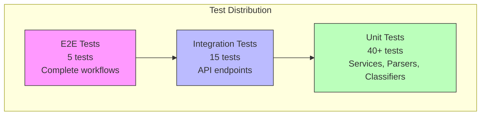

# Testing Guide

## Overview

| Metric | Target |
|--------|--------|
| Code Coverage | >85% |
| Test Framework | Jest |
| Assertion Library | Jest built-in |
| HTTP Testing | Supertest |

## Test Pyramid



## Running Tests

### All Tests

```bash
npm test
```

### With Coverage Report

```bash
npm run test:coverage
```

Coverage report is generated in `coverage/` directory. Open `coverage/lcov-report/index.html` in a browser for detailed view.

### Watch Mode

```bash
npm run test:watch
```

### Run Specific Test File

```bash
npm test -- tests/test_ticket_api.test.ts
```

### Run Tests Matching Pattern

```bash
npm test -- --testNamePattern="should create ticket"
```

## Test File Structure

```
tests/
├── fixtures/                    # Sample test data
│   ├── valid_tickets.csv
│   ├── valid_tickets.json
│   ├── valid_tickets.xml
│   ├── invalid_tickets.csv
│   └── invalid_tickets.json
├── test_ticket_api.test.ts      # API endpoint tests
├── test_ticket_model.test.ts    # Model validation tests
├── test_import_csv.test.ts      # CSV parser tests
├── test_import_json.test.ts     # JSON parser tests
├── test_import_xml.test.ts      # XML parser tests
├── test_categorization.test.ts  # Classification tests
├── test_integration.test.ts     # End-to-end tests
└── test_performance.test.ts     # Performance benchmarks
```

## Test Categories

| Test File | What it Tests | Expected Tests |
|-----------|--------------|----------------|
| test_ticket_api | CRUD endpoints, status codes, error responses | 11 |
| test_ticket_model | Joi validation, field constraints | 9 |
| test_import_csv | CSV parsing, column mapping, error handling | 6 |
| test_import_json | JSON parsing, array/object handling | 5 |
| test_import_xml | XML parsing, nested elements | 5 |
| test_categorization | Keyword matching, confidence scores, priority | 10 |
| test_integration | Complete workflows, concurrent requests | 5 |
| test_performance | Response times, bulk operations | 5 |

## Sample Test Data

### Location

All test fixtures are in `tests/fixtures/`

### Files

| File | Records | Purpose |
|------|---------|---------|
| valid_tickets.csv | 3 | Valid CSV import |
| valid_tickets.json | 2 | Valid JSON import |
| valid_tickets.xml | 2 | Valid XML import |
| invalid_tickets.csv | 3 | Validation error testing |
| invalid_tickets.json | 2 | Validation error testing |

### Sample Ticket Data

```json
{
  "customer_id": "CUST001",
  "customer_email": "test@example.com",
  "customer_name": "Test User",
  "subject": "Test ticket subject",
  "description": "This is a test ticket description with enough characters",
  "category": "technical_issue",
  "priority": "medium"
}
```

## Manual Testing Checklist

### Ticket CRUD Operations

- [ ] Create ticket with valid data → 201 Created
- [ ] Create ticket with invalid email → 400 Validation Error
- [ ] Create ticket with short description → 400 Validation Error
- [ ] Get existing ticket → 200 OK
- [ ] Get non-existent ticket → 404 Not Found
- [ ] Update ticket status → 200 OK
- [ ] Delete ticket → 200 OK
- [ ] List all tickets → 200 OK with count

### File Import

- [ ] Import valid CSV file → Success count matches
- [ ] Import valid JSON file → Success count matches
- [ ] Import valid XML file → Success count matches
- [ ] Import CSV with invalid rows → Partial success with error details
- [ ] Import unsupported file type → 400 Bad Request
- [ ] Import empty file → Error message

### Auto-Classification

- [ ] Classify ticket with login keywords → account_access category
- [ ] Classify ticket with billing keywords → billing_question category
- [ ] Classify ticket with urgent keywords → urgent priority
- [ ] Classify ticket with no keywords → other category, medium priority
- [ ] Get classification history → Array of decisions

### Filtering

- [ ] Filter by category → Only matching tickets
- [ ] Filter by priority → Only matching tickets
- [ ] Filter by status → Only matching tickets
- [ ] Multiple filters → Intersection of filters

### Error Handling

- [ ] Invalid JSON body → 400 Bad Request
- [ ] Missing required field → 400 Validation Error
- [ ] Invalid enum value → 400 Validation Error

## HTTP Client Testing

Use the provided `tests/api.http` file with WebStorm or VS Code REST Client extension:

1. Start the server: `npm run dev`
2. Open `tests/api.http`
3. Execute requests sequentially
4. Replace `{{ticket_id}}` with actual IDs from responses

## Performance Benchmarks

| Operation | Target | Method |
|-----------|--------|--------|
| Create ticket | <50ms | Single POST request |
| Get ticket | <10ms | Single GET request |
| List 100 tickets | <100ms | GET with populated store |
| Import 50 tickets | <500ms | CSV file upload |
| Auto-classify | <20ms | POST to classification endpoint |
| Concurrent requests (20) | <200ms total | Parallel requests |

### Running Performance Tests

```bash
npm test -- tests/test_performance.test.ts
```

## Writing New Tests

### Test Template

```typescript
import request from 'supertest';
import app from '../src/app';
import { store } from '../src/store/inMemoryStore';

describe('Feature Name', () => {
  beforeEach(() => {
    store.clear(); // Reset store before each test
  });

  it('should do something', async () => {
    const response = await request(app)
      .post('/tickets')
      .send({ /* test data */ });

    expect(response.status).toBe(201);
    expect(response.body).toHaveProperty('id');
  });
});
```

### Best Practices

1. **Isolate tests** - Clear store in `beforeEach`
2. **Test one thing** - Each test should verify one behavior
3. **Use descriptive names** - `should return 404 when ticket not found`
4. **Test edge cases** - Empty inputs, boundary values
5. **Test error paths** - Not just happy paths
