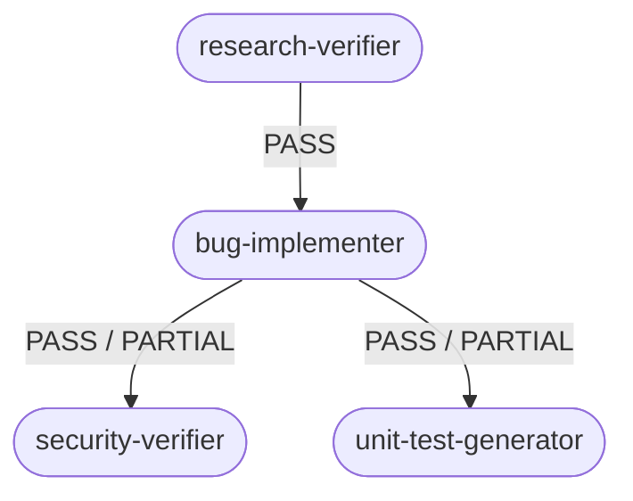

# How to Run

## Prerequisites

- Node.js 18+
- Claude Code CLI with an active Anthropic API key

---

## 1. Run the Pipeline

Open a Claude Code session from the repo root and paste:

```
Act as the agent defined in homework-4/agents/research-verifier.agent.md. Run it now.
```

The Research Verifier starts the chain automatically:



Each agent gate-checks its own output before launching the next stage. If any stage fails, the chain stops and the failure is documented in that stage's output artifact.

Artifacts are written to `context/bugs/<BUG-ID>/`:

| File | Contents |
|------|----------|
| `research/verified-research.md` | Quality rating + verified claims |
| `fix-summary.md` | Applied change + verification results |
| `security-report.md` | Severity-rated security findings |
| `test-report.md` | Test results + FIRST assessment |

---

## 2. Run the Demo App

```bash
cd demo-bug-fix
npm install
npm start        # → http://localhost:3000
```

```bash
curl http://localhost:3000/health       # → { status: "ok" }
curl http://localhost:3000/api/users    # → list of all users
```

---

## 3. Run the Tests

```bash
cd demo-bug-fix
npm test
```

Expected: **8 passed, 8 total**.
