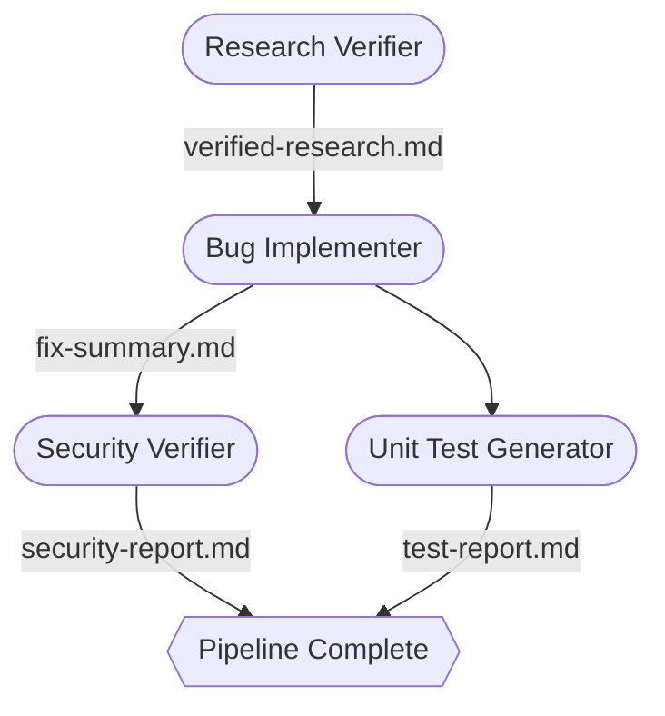

# Homework 4 — 4-Agent Bug-Fix Pipeline

A Claude Code multi-agent pipeline that takes an open bug report and autonomously researches, fixes, audits, and tests it — with gate checks between every stage.

## How It Works



| Agent | What it does |
|-------|-------------|
| **Research Verifier** | Fact-checks every file path, line number, and code snippet in the research doc; rates overall quality |
| **Bug Implementer** | Applies the fix from the implementation plan; records a before/after diff |
| **Security Verifier** | Scans the changed code across 9 security categories with severity ratings |
| **Unit Test Generator** | Writes and runs unit tests; validates them against FIRST principles |

Stages 3 and 4 run in parallel. The **Orchestrator** (`agents/pipeline-orchestrator.agent.md`) coordinates everything and prints a final pass/fail status board.

## Running

**One command** — paste this into a Claude Code session:

```
Act as the agent defined in homework-4/agents/pipeline-orchestrator.agent.md. Run it now.
```

**Or run agents manually**, in order:

```
1. Act as agents/research-verifier.agent.md. Run it.
2. Act as agents/bug-implementer.agent.md. Run it.
3. Act as agents/security-verifier.agent.md. Run it.     ← parallel
4. Act as agents/unit-test-generator.agent.md. Run it.   ← parallel
```

> The pipeline expects the code to be in its **buggy state** when it starts.

## The Example Bug

`GET /api/users/:id` returns 404 for every valid user ID because `req.params.id` is a `string` while array IDs are `number` — strict equality never matches.

**Fix** (`src/controllers/userController.js`):
```js
// Before
const userId = req.params.id;
// After
const userId = Number(req.params.id);
```

## Demo App

```bash
cd demo-bug-fix && npm install && npm test   # 8 tests, all pass
npm start                                    # → http://localhost:3000
```

## Outputs

All artifacts are written to `context/bugs/API-404/`:

| File | Contents |
|------|----------|
| `research/verified-research.md` | Quality rating + verified claims |
| `implementation-plan.md` | Before/after diff |
| `fix-summary.md` | Applied change + curl results |
| `security-report.md` | 9-category security scan |
| `test-report.md` | Test results + FIRST assessment |
